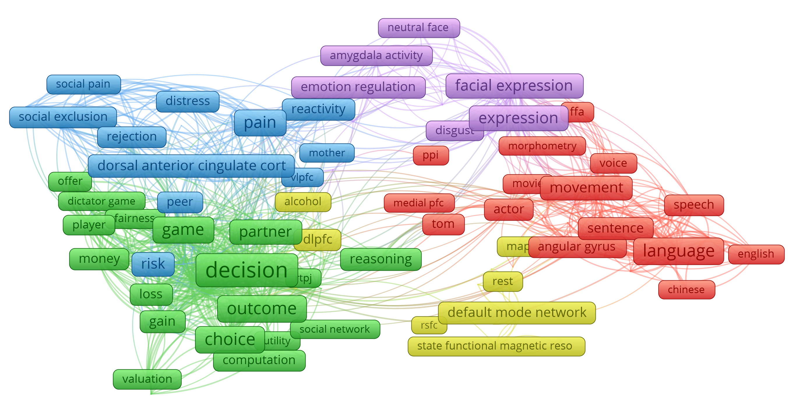

```{r setup, include=FALSE}
knitr::opts_chunk$set(echo = TRUE)

setwd("C:/Users/peder/Dropbox/jobb/PhD/Projects/2019_NeuroRep_Replication_Value/collaborator_directories/peder/neurorep_data_exploration_data_and_scripts")

library(tidyverse)
library(psych)
library(gridExtra)
library(corrplot)
library(knitr)
library(pander)


#### Load data #### 
codebook <- read.table(file = "codebook.tsv", header = T, sep = "\t")
data.bib <- readRDS("data_bib.Rds")  # Bibliometric data for all articles that survived keyword exclusion
data.all <- readRDS("data_all.Rds")  # Bibliometric data + sample size of all individual studies selected for sample size coding
data.irr <- readRDS("data_irr.Rds")  # Sample size inter-rater reliability data for sample of studies selected for triple-coding
```

# Determining an initial set of candidates

The first step of our procedure was to determine a suitable set of candidate studies given our replication goals. Our research field of interest is social neuroscience, and our methodological interests pertain to fMRI research. We also determined to restrict our candidate set to studies published in the last ten years (later than 2009 at the time this decision was made). Our aim was thus to generate a representative sample of recently published fMRI studies within social neuroscience. In addition, we needed to determine a procedure for excluding studies from our candidate set that we would not be able to replicate (e.g. animal model research, highly invasive methodologies, research on patient groups, etc.). 

We collected all records from the Web of Science database (citation). Because Web of Science does not have a predefined category of ‘Social Neuroscience’ we utilized two strategies for identifying social neuroscience research within the database. One strategy involved scraping all records from field-specific journals listed in the Web of Science. The other strategy involved scraping all records from Web of Science matching the key terms "social" and "fMRI". From the this initial set of records we then excluded a number of records when keyword information suggested the record would be unsuitable as a candidate in our replication effort.

Once a final set of candidate records had been determined, we explored the available bibliographic information to ensure that the sample indeed seemed representative of the field of social neuroscience fMRI research. 

## Methods/Procedure

We identified four journals in the Web of Science database as social neuroscience journals (*list journals*). Empirical articles published in these journals were identified by submitting the following search term to Web of Science: 

[search term]

The search was conducted on YYYY-MM-DD. XXXX records were identified via this search strategy.

Searching field-specific journals is bound to miss many important studies in a field like social neuroscience, since many studies in this field are published in general topic journals like PLOS ONE, PNAS and Neuroimage. To be able to identify such studies and add them to our candidate set, we searched the entire Web of Science database for studies containing the keywords "social" and "fMRI" in either title or abstract. This general keyword combination is combatible with the description of many different topics in social neuroscience fMRI research, even for studies published in general topic journals. 

Empirical articles containing the relevant keyword information were identified by submitting the following search term to Web of Science: 

[search term]

The search was conducted on YYYY-MM.DD. XXXX records were identified via this search strategy.

Unsurprisingly, the two strategies yielded overlapping results, as studies published in social neuroscience journals are likely to contain the keywords "social" and "fMRI". After removing duplicate records, the two search strategies yielded XXXX unique empirical articles in total. These articles were considered our initial canidate set, and basic bibliometric information about each article, including author-provided keywords, were downloaded for all articles in the initial set. 

Author PI and AV subsequently reviewed the 9807 unique author-provided keywords used to describe candidates in the initial set and curated a list of keywords to be used for further exclusion of articles. For example, we excluded all studies containing keywords such as "rats", "canine", "infants", "als", and any other term suggesting that the study would require access to a non-healthy/non-adult/non-human participant population, which would be unfeasible for our replication efforts. The complete records of excluded keywords can be found at [link to osf]. After excluding articles based on keyword information, our final set of candidates contained XXXX empirical articles. 

### Statistical analyses and exploration - summary

To verify that our final candidate set seemed representative of (human) social neuroscience research, we conducted several exploratory analyses of the rich bibliometric information available for each article via Web of Science. We explored the frequency distribution of journal outlets in order to verify that the journals most fequently chosen in our data correspond to popular publication outlets in social fMRI research. We explored the frequency distribution of Web of Science field categories (citation) to verify that categories such as "neurosciences", "social psychology", "psychology" and "multidisciplinary" were prevalent in our data. 

In addition to exploring journal outlets and general field categories, we wanted to ensure that subfields and topics known to be prevalent in social fMRI research (e.g. social pain research [citation], face perception research [citation] and experimental paradigms from behavioral economy such as the dictator game [citation]). To this end, we acquired additional bibliometric information from the Centre for Science and Technology Studies (CWTS, [citation/link]) about prevalent citation clusters in our data (a proxy for scientific subfields contained within a larger research field). A citation cluster is determined by [ask Thed to write a short description on how CWTS determines citation clusters]. We analyzed the distribution of these clusters in our data, and we studied the frequency of category labels used to describe various clusters [ask Thed to write a summary of how these are derived]. Our goal was to verify that subfields and topics expected to be common were in fact freqently mentioned, and that no topic clearly irrelevant to social neuroscience were prominently featured. 

To augment these analyses, we also utilized the statistical visialization software VOSviewer to extract commonly mentioned terms from the titles and abstracts of all studies, and we studied whether terms co-occured in line with our prior knowledge of terminology in different subfields of social neuroscience. All data included in the final dataset were subjected to analysis in VOSviewer with the parameters:

[list VOSviewer parameters and link to map files on OSF]


## Results

```{r echo=FALSE}

# Plot journals most frequently published in

jou.freq <- as.data.frame(tail(sort(table(data.bib$SO)), 20))
levels(jou.freq$Var1) <- sub("PROCEEDINGS OF THE NATIONAL ACADEMY OF SCIENCES OF THE UNITED STATES OF AMERICA", "PNAS", levels(jou.freq$Var1))


g.jou.freq <- ggplot(jou.freq, aes(x = Var1, y = Freq)) +
  geom_col() +
  labs(title="Journals most frequently published in",
       x = NULL,
       y = "Frequency") +
  coord_flip() +
  theme_bw()

## Number of journals in dataset

n.journals <- nrow(unique(select(data.bib, SO)))  


# Plot WoS research fields most frequently tagged

field.freq <- as.data.frame(tail(sort(table(data.bib$WC)), 20))
field.freq <- field.freq[order(-field.freq$Freq),]
names(field.freq) <- c("field", "frequency")


g.field.freq <- ggplot(field.freq, aes(x = field, y = frequency)) +
  geom_col() +
  labs(title="WoS research fields most frequently tagged",
       x = NULL,
       y = "Frequency") +
  coord_flip() +
  theme_bw()

## Number of WoS categories in dataset

n.woscats <- nrow(unique(select(data.bib, WC)))  


# Plot most frequent primary cluster labels

labels <- c(data.bib$label1, 
            data.bib$label2, 
            data.bib$label3, 
            data.bib$label4, 
            data.bib$label5)  # Combine all labels into one string variable

lab.freq <- as.data.frame(tail(sort(table(labels)), 50))  # count prevalence of each string and save 50 most prevalent
lab.freq <- lab.freq[order(-lab.freq$Freq),]
names(lab.freq) <- c("label", "frequency")

g.lab.freq <- ggplot(lab.freq, aes(x = label, y = frequency)) +
  geom_col() +
  labs(title="Most frequent primary cluster labels",
       x = NULL,
       y = "Frequency") +
  coord_flip() +
  theme_bw()

n.labels.total <- length(unique(labels))

## Number of unique clusters/subfields contained in set

n.clusters <- nrow(unique(select(data.bib, cluster_id1, n_pubs)))  


# Plot distribution of cluster size

clu.siz <- unique(select(data.bib, cluster_id1, n_pubs))

g.clu.siz <- ggplot(clu.siz, aes(x = n_pubs)) +
  geom_histogram() +
  labs(title="Number of publications in clusters/subfields",
       x = "Cluster size",
       y = "Frequency") +
  theme_bw()

clu.summary <- describe(data.bib$n_pubs)

```


### Distribution of studies over journals

The records included in our dataset was published in `r n.journals` different journals. This is in line with our expectation that social neuroscience is a broad and loosely connected research field with a great number of subfield contained within. 

Figure 1 displays the name and frequency of the 20 journals most frequently published in (*Peder draft note: We could also change this to be a table. Or we could turn the tables below into figures like this. Whatever helps readability the most.*). Unsurprisingly, two of the four journals from which all records were initially scraped were also among the most prominent journals in the final set of studies (Social Cognitive and Affective Neuroscience, and Social Neuroscience). Besides these two, the sample appears to be dominated by journals that are either general topic, (Plos ONE and PNAS) or general neuroscience/psychology (e.g. Neuroimage, Frontiers Psychology, Cortex). The lack of specialist journals in the top end of the frequency distribution is likely due to the fact that these journals only serve a smaller subsection of the larger community of social neuroscientists, while journals like Neuroimage and Plos ONE can, in principle, serve them all. 

```{r, echo=FALSE}
plot(g.jou.freq)
```


### Distribution of studies over Web of Science categories

The records in our dataset was classified as being members of `r n.woscats` unique Web of Science categories. Table 1 displays the name and frequency of the 20 Web of Science categories most frequently tagged. 

```{r echo=FALSE}
kable(field.freq, caption = "Journals most frequently published in", row.names = FALSE)
```

### Citation clusters and frequently co-occuring keywords

Examining bibliometric information from CWTS, we found that the records in our dataset is contained in `r n.clusters` unique citation citation clusters. As shown in Figure 2, the number of articles in each cluster varies substantially (min=`r clu.summary$min`, median=`r clu.summary$median`, max=`r clu.summary$max`).

```{r, echo=FALSE}
plot(g.clu.siz)
```

To better understand the scientific topic covered by these citation clusters, we inspected the category labels assigned to each cluster by CWTS. In total, the citation clusters were associated with `r n.labels.total` unique labels. Table 2 displays the frequency of the 50 most frequently mentioned category labels in our data.   

```{r echo=FALSE}
kable(lab.freq, caption = "Most frequent cluster labels", row.names = FALSE)
```

To complement the cluster information from CWTS, we utilized the VOSviewer analysis tool to extract topic-related keywords from article titles and abstracts, and analyze co-occurences between these keywords. Figure 3 displays the co-occurence map between commonly mentioned keywords in our dataset. 



## Discussion

Based on the bibliometric information summarized above, we feel confident that we have successfully managed to sample articles from human social fMRI research. Journals common in the field of social neuroscience are also frequent within our data. The Web of Science category distribution is similarly consistent with what we would expect from studies sampled from social neuroscience research, with categories such as "Neurosciences; Psychology; Psychology, Experimental" and "Multidisciplinary Sciences" being among the most common. On the other hand, it is somewhat surprising that categories such as "Psychology, Social" and "Neuroimaging" are not more prevalent in a dataset that is supposed to contain fMRI studies of social psyhological phenomena. 

The concern about prevalence of fMRI methodology and social psychology phenomena in the dataset is however relieved by inspecting the distribution of CWTS cluster labels and the VOSviewer co-occurence map. On the one hand, "fmri" and "fmri data" are among the 50 most common labels used to describe citation clusters to which our data belongs. On the other hand, terms such as "imitation", "empathy" "mirror neuron", "facial expression", and "social exclusion" suggests that topics common in social fMRI research are also well-represented in our dataset. The VOSviewer co-occurence map shows that topics frequent in article titles and abstract overlap with topics frequent within the CWTS cluster labels. 

The co-occurence map also suggests a number of larger subtopics within the data. As expected from a set of articles sampled from social neuroscience, language, social pain and exclusion, and face perception seem to be highly prevalent themes. Not consistent with our expectations is the prominent cluster of studies related to the default mode network and functional connectivity. Visual inspection of titles that are categorized in the "default mode" cluster by CWTS suggests that many of these articles are purely methodological, and a vast majority do not seem to be concerned with social neuroscience as such. 

Another unexpectedly prevalent topic in the co-occurence map is that centered around decision-making. Convergently, the 5 most frequent CWTS cluster labels (table 2) all seem related to choice and decision making, which is not obviously a topic sorted under social neuroscience. Reviewing the titles and abstracts of articles within the CWTS "decision making" cluster, reveals a more nuanced picture. The citation cluster described by the labels "intertemporal choice", "decision making", "delay discounting", "impulsivity" and "iowa gambling task" is the most prevalent cluster in our data (`r sum(data.bib$cluster_id1 == 692, na.rm = T)` articles in our data belong in this cluster). However, the CWTS labels used to describe this cluster are not necessarily representative of the articles from this cluster that are included our dataset. For example, although "iowa gambling task" is descriptive of the cluster as a whole, only a single article from this cluster in our dataset even mentions the Iowa gambling task. We therefore consider it likely that we have sampled a biased subset of articles from this cluster, which seems plausible considering that the cluster contains a total of `r mean(data.bib$n_pubs[data.bib$cluster_id1==692], na.rm = T)` articles. The articles from this cluster that are contained in our data concern a variety of topics, most of which more clearly related to social psychology than the cluster labels would indicate. For example, neuromarketing designs and study designs common in behavioral economy (e.g. ultimatum and trust games) appear frequently, which also explains the frequent co-occurences of terms like "decision", "outcome", "choice", "partner" and "game" (Figure 3). However, we should note that there also appears to be a number of purely methodological articles in this subset, suggesting that our method of excluding methodological articles by article keyword information was not entirely successful. 

In summary, our exploratory analyses suggest that we have been largely successful in curating a large set of studies from the social neuroscience literature that employ fMRI methodology and otherwise adhere to our inclusion criteria. However, we remind the reader that the results above summarizes only a subset of a larger collection of bibliometric information available for our dataset. The results we report are those we believe are most relevant for evaluating whether we have successfully sampled the population of human social fMRI research. However, the full dataset including all bibliometric variables are available at [OSF link to data] for the curious/sceptical reader. 


# Operationalizing value and uncertainty

Having determined on a set of candidate articles to consider for replication, the next step in our selection procedure was to derive a quantitative estimate of replication value for each replication candidate included in our dataset. In theory, this simply involves determining a suitable formula for estimating RV, collecting the necessary data for each candidate, and applying the formula to each candidate study in the dataset. However, in practice there are several additional challenges to consider.

First, we must settle on a quantitative definition of RV that is likely to be valid for estimating the expected utility of our replication attempt (Isager et al. 2020). We determined to use the formula described in Isager et al. (2020 - thesis chapter 2) as our primary definition of RV. However, this formula is not yet validated empirically, neither in general nor in social fMRI research specifically. Thus, in addition to collecting the information necessary to calculate the formula described in Isager et al. (2020 - thesis chapter 2), we aimed to identify additional quantitative indicators that might be important for estimating RV. We also aimed to collect quantitative information that would let us compare the performance of the Isager et al. (2020) indicator with other potential operationalizations of RV (e.g. Field et al. 2019, which required information about bayes factors). 

Second, given that the target of a replication study is a claim (Isager et al. 2020 - chapter 1), and given that any article in our dataset may contain multiple claims, we must decide which claims from each article to focus our formula RV estimates on. We initially determined to focus our efforts on the main claim from each study from each article in our set of candidates. This means that each article in our dataset actually represents as many replication canidates as there are empirical studies reported in that article. We subsequently began the process of coding, for each individual study in each article, the main finding reported for that study. 

Third, we needed to determine which quantitative indicators of "value" and "uncertainty" are feasible to collect in practice, as this would determine which operationalizations of RV we could consider estimating. For instance, we knew that the formula of Isager et al. (2020) ideally requires enough statistical information that a standard error can be calculated. This implies that it must be possible for us to identify statistical tests of each claim under consideration, and also that the necessary information about standard deviations, sample size etc. must be available for each of these tests. Finally, given the large number of canidates we are considering, we reuire a quick and efficient method for collecting the necessary quantitative information.

## Operationalizing "value"

We utilized various citation impact metrics as indicators of the value of each replication candiate, following the equation and rationale laid out in Isager et al. (2020, thesis chapter 3). We needed to select a single bibliometric source to rely in for citation impact estimates. However, in practice their are sources to choose from (Crossref, Scopus, Web of Science, etc.), and no principled reason for preferring one over the other. We therefore decided to collect citation count information from several bibliometric sources and inspect the similarity of the citation count estimates provided. We collected citation count data from Web of Science (provided with the bibliometric data collected when identifying the initial canidate set), Crossref (using the rcrossref package in R [citation]), Scopus (using the rscopus package in R [citation]), and CWTS (provided by CWTS staff). 

To address the fact that different subfields may have different citation practices that inflate citation counts in some fields compared to others, we also collected field-normalized citation scores from the CWTS database (see [citation] for details about the normalization procedure). Since it is not completely clear whether field-normalized citation scores should be preferred to non-normalized scores for calculating replication value (Isager et al. 2020 - either chapter 1 or 3 discusses whether normalizing scores makes sense) our initial goal was simply to observe the correlation between field-normalized and non-normalized scores, to better understand the impact of choosing one or the other. 

Finally, we also collected Altmetric scores (cite explanation of scores) as an alternative operationalization of impact. Altmetric scores are known to be only weakly associated with more traditional citation metrics (cite the bibliometric article pointing this out), which presumably reflects the fact that Altmetric scores capture other aspects of impact than do traditional citation counts. 

## Operationalizing "uncertainty"

Following the formula of Isager et al. (2020, cite chapter 3), we initially determined to operationalize the uncertainty about a claim before replication in terms of the sample size (specifically, the number of participants) of the study supporting the claim. However, sample size is a limited indicator of uncertainty, and we know that there are other quantitative operationalizations of uncertainty that would likely be more accurate, such as the standard error of the effect estimates used to support a claim (Isager et al. 2020 - chapter 3) or the Bayes factor of hypothesis comparisons used to support a claim (Field et al. 2019). 

In an attempt to provide initial validation of the formula in Isager et al. (2020), we therefore attempted to identify and calculate alternative quantitative operationalizations of replication value. Our overall goal was to study the similarities and differences between the estimates of different formula operationalizations of replication value. In practice, we also needed to find out which information could feasibly be collected for the large number of studies in our candidate set. E.g. we suspected that collecting the sample size of all relevant studies in the dataset would be an easier task than calculating standard error of each relevant effect in the data, since calculating the standard error requires additional information, such as the standard deviation, that may not always be available in the published report. 

In the following two sections, we briefly summarize two pilot studies that were undertaken with these goal in mind. In the first study, we surveyed a small sample of fMRI researchers to better understand which information is important for judging uncertainty about claims in this field. In the second study, we attempted to identify the "main claim(s)" of individual research articles. 

### Consulting field experts to identify potential quantitative indicators of uncertainty

To better understand what information is important for assessing uncertainty about findings from fMRI research, we constructed a survey to probe experts in fMRI research (defined as researchers with, or in the process of completing, a PhD who has experience with collecting and/or analyzing fMRI data) about which information they use to assess the quality and quantity of evidence for fMRI findings in their field. The survey contained open-ended items encouraging researchers to fill inn whatever information they considered important for assessing evidence. The survey also contained a number of questions asking researchers to rate and rank-order the importance of specific types of information for assessing evidence (e.g. the statistical power of the study, the results of a replication study, the prevalence of statistical errors in the report, etc.). For each such question, we also asked for open-ended comments to better understand how the information was being used by researchers to assess evidence. For example, in one question we asked researchers to rate the importance of "the percentage of participants that were excluded". For this question, we also asked participants to "indicate in what way you believe this information is related to the quality and quantity of evidence in support of a finding". We also asked participants to rate and comment on the importance of sample size, and we used the responses on these items as a preliminary validation of whether sample size relates to uncertainty in the way assumed by Isager et al. (2020). The survey and all questions are openly available at [link to survey on OSF]

The pilot data collection was carried out on a convenience sample of colleagues of the first (Peder) and second (Anna) author. Eleven researchers responded to the survey. The pilot dataset is too small to allow detailed interpretations of the quantitative data. Here we simply give a summary of the course qualitative conclusions we drew from the data. All data collected are openly available at [link to data on OSF]. 

There seemed to be broad agreement among experts that sample size is important for evaluating the quality and quantity of evidence for a typical fMRI finding. Several experts freely offered sample size as a piece of information they would be evaluating when assessing the credibility of a finding. In addition, when asked to rank-order the importance of different pieces of information, sample size was ranked higher than average by all experts. In addition, statistical power, partially a function of sample size, was consistently highly rated by experts, and one expert explicitly pointed to the relationship between sample size and power in their comments ("Sample size is the easiest way to increase statistical power"). Finally, when asked specifically about the importance of sample size, there seemed to be broad agreement that a higher sample size generally entails higher credibility, in line with the assumptions of Isager et al. (2020). However, two experts described feeling less confident about findings supported by a very high sample size, due to the elevated risks of overinterpreting trivially small and meaningless effects (a problem often referred to as "the crud factor", Meehl 1990; Orben and Lakens 2020). Nonetheless, we interpreted these results as preliminary validation of correspondence between the rationale of Isager et al. (2020) and how experts actually use sample size when evaluating uncertainty. 

Besides sample size (and statistical power) there were a few other pieces of information that experts seemed to agree would be important for assessing the credibility of findings: 

* The results of a replication study (particularly if the replication was conducted by independent investigators).
* Open access to the underlying empirical data that were analyzed.
* The presence of statical errors in reporting.

Beyond these factors, experts did not consistently agree on whether or how various pieces of information would be important for assessing the credibility of findings. This includes several statistical indicators commonly available in fMRI study reports, such as Z- and p-values for peak voxels in clusters, cluster extent (in number of voxels), and number of participants excluded.

[*Consider adding a table of numeric and verbal summaries for each information piece we asked about here*]

### Identifying the "main finding" for each article

Some information that is relevant for assessing replication value is related to individual empirical findings within studies. If we want to use such information to compare the replication value of two studies, we first need to decide which findings from each study to use for our comparison. For example, consider the use standard error of the mean for calculating the RV formula of Isager et al. (2020 - Chapter 2). Assuming we do not approximate the standard error via the total sample size of the study, standard error is related to a particular mean estimate within the study. Since a study may report many mean estimates, it may be related to any number of standard errors. Thus, it is no longer enough to decide which studies to include as replication candidates. We now also have to decide which specific findings from these studies to consider, because the RV estimates depend on statistical information from these findings. 

We conducted a pilot study to try and identify the *main finding* of each study in our set of replication candidates. The main finding is defined as the reported finding which is centrally highlighted in either the abstract or conclusion section of the article in which the study is reported, and which seems to be the focus point of the study design. For example, the finding that the fusiform face area is reliably and selectively activated by images of faces (cite original FFA research) is the main finding used to support the more general claim that faces are processed in a specific spatial location within the human brain. Our ultimate goal was to identify indicators of statistical uncertainty for each main finding (such as standard error of the mean, and Bayesian posterior evidence) from which different estimators of replication value could be constructed, calculated on our candidate set, and compared. 

Main findings for each paper had to be coded manually. We developed a general coding procedure, instructing coders on where in the paper to look for mentions of the main finding, and what would indicate that something is a main finding. These guidelines were never completely developed and refined, but a working draft version is available at (link to doc on OSF) for the interested reader. Three co-authors (Peder, Anna and Leonie) then applied this procedure to a small set of studies within our candidate set to test the feasibility of the procedure. All data from this small coding effort is available at (link to data on OSF). Below follows a brief summary of our own conclusions. 

Our pilot suggested that main findings from each study could indeed be identified. Identification was relatively time-intensive (a few minutes per study) and varied considerably. Some studies included the main claim in the title, in which case coding could take seconds. Other studies required coders to consult several sections of the article to verify that a claim was indeed the *main* claim. In these cases coding could take up to several minutes. In every case, the main finding of the study was mentioned in the abstract of the article in which the study appeared. 

With respect to identifying statistical information for each finding, however, we quickly realized that this would become challenging. By and large, main findings were associated with a number of different statistical results. Consider the following, example: 

> *In two experiments, we used a functional magnetic resonance (fMR)-repetition suppression paradigm to demonstrate that distinct frontal–parietal–temporal regions are sensitive to processing the scenarios or what participants imagined was happening in an event (e.g. medial prefrontal, posterior cingulate, temporal–parietal and middle temporal cortices are sensitive to the scenarios associated with future social events), people (medial prefrontal cortex), objects (inferior frontal and premotor cortices) and locations (posterior cingulate/retrosplenial, parahippocampal and posterior parietal cortices) that typically constitute simulations of personal future events. This pattern of results demonstrates that the neural substrates of these component features of event simulations can be reliably identified in the context of a task that requires participants to simulate complex, everyday future experiences.* - Szpunar et al. (2014)

It is clear that many statistical results are being utilized in this statement, and it is not clear which, if any, would be more appropriate to serve as the results on which a replication value estimate is based. Many of the findings identified in our pilot had a similar structure to the example above. We suspect this finding structure will be common in the field of social fMRI, where hypotheses are often of the form "what does neural activity look like for task/manipulation/stimulus/group X" and so relates to multiple aspects of the fMRI data collected. For the purposes of collecting statistical data for replication value estimation, it appears it would not be enough to simply identify the main finding of each study in our dataset. We would also have to determine, for each finding, which empirical results to extract statistical information from and how to the common case where a finding is related to multiple statistical results. Due to the labor intensity implied by these pilot results, we determined not to proceed with the coding of main findings in this project. 


* Summary paragraph concluding that only sample size will be used to quantify uncertainty after the efforts discussed above.


# Calculating replication value.

## Introduction


## Reliability checks

### Sample size inter-rater reliability

### Reliability of citation scores across sources

To better understand the reliability of various citation scores, we explored the strenght of association between the following citation metrics: 

```{r echo=FALSE}
metric.names <- c("WoS", "Crossref", "Scopus", "CWTS", "CWTS_normalized", "Altmetric")
metric.desc <- c(codebook[81, 2], codebook[78, 2], codebook[79, 2], codebook[89, 2], codebook[91, 2], codebook[80, 2])
metric.n <- c(sum(!is.na(data.bib$TC_2020)),
              sum(!is.na(data.bib$crossref_citations)),
              sum(!is.na(data.bib$scopus_citations)),
              sum(!is.na(data.bib$tcs)),
              sum(!is.na(data.bib$tncs)),
              sum(!is.na(data.bib$altmetric_score)))

t.cit.metrics <- data.frame("citation metric" = metric.names, 
                            "description" = metric.desc, 
                            "N" = metric.n)

pander(t.cit.metrics)
```

Strength of association was explored by correlating all citation metrics with one another. Due to the skewed distribution of all citation metrics, and because we are chiefly concerned with the rank-ordering of the records (Isager et al. 2020 - Chapter 1) Spearman's rho was selected as correlation coefficient for these analyses.

In addition, we expected WoS, Crossref, Scopus, and CWTS to be highly correlated measures of the same underlying construct - the raw academic citation impact of an article. To test this expectation, we subjected the citation scores from these sources to an intraclass correlation analysis (model = two-way fixed effects, type = single rater, definition = consistency). 

## Results

### Sample size inter-rater reliability

```{r, include=FALSE}
# Percentage exact agreement
all.match <- sum(data.irr$matches_all)/nrow(data.irr)
orig.BA.match <- sum(data.irr$matches_orig_BA)/nrow(data.irr)
orig.PhD.match <- sum(data.irr$matches_orig_PhD)/nrow(data.irr)
BA.PhD.match <- sum(data.irr$matches_BA_PhD)/nrow(data.irr)

nonmatches <- data.irr[data.irr$matches_all==0,]
orig.final.match <- sum(nonmatches$sample_size_orig==nonmatches$sample_size_final)
BA.final.match <- sum(nonmatches$sample_size_BA==nonmatches$sample_size_final)
PhD.final.match <- sum(nonmatches$sample_size_PhD==nonmatches$sample_size_final)

# Intra-class correlation 
icc <- ICC(data.irr[, c("sample_size_orig", "sample_size_BA", "sample_size_PhD")])

# Dot plots of relationship between each oair of coders

df.ba <- data.frame(sample_size_orig=data.irr$sample_size_orig, sample_size=data.irr$sample_size_BA, coder="undergrad")
df.phd <- data.frame(sample_size_orig=data.irr$sample_size_orig, sample_size=data.irr$sample_size_PhD, coder="PhD")
df.irr <- rbind(df.ba, df.phd)

g.irr <- ggplot(data=df.irr, aes(x=sample_size_orig, y=sample_size, col=coder, shape=coder)) +
  geom_point(alpha = 0.6, size=3) +
  theme_bw() +
  scale_x_continuous(trans='log10', name = "sample size, coded by original coder") +
  scale_y_continuous(trans='log10', name = "double-coded sample size")

```

```{r fig1, echo=FALSE, fig.cap="Variation in sample size between coders. Sample size is plotted on log scale. The original sample size coded is represented on the x-axis. Double-coded sample size values are represented on the y-axis. Red circles represent values from the PhD coder. Green triangles represent values from the undergraduate student coder."}
plot(g.irr)
```

Overall, there was a high but imperfect agreement between the three coders (percentage exact agreement = `r all.match`). The BA double coder and the PhD coder had a slightly higher agreement rate (percentage exact agreement = `r orig.PhD.match`) than either one had with the original BA coders (percentage exact agreement between original BA coders and BA double coder = `r orig.BA.match`, percentage exact agreement between original BA coders and PhD double coder = `r orig.PhD.match`). The intraclass correlation coefficient between raters was high, ICC = `r icc$results["Single_raters_absolute", "ICC"]`, CI95%[`r icc$results["Single_raters_absolute", "lower bound"]`, `r icc$results["Single_raters_absolute", "upper bound"]`]. Figure \ref{fig:fig1} displays the variation in sample size between the coders, plotted on log scale. 

Coders disagreed in `r nrow(nonmatches)` cases. Because coding was conducted at different times by all coders, all disagreements between coders were resolved by the PhD coder. The final sample size was then substituted for the original coder values and used in subsequent analyses. In those cases where coders disagreed, the final sample size after resolving agreed with the original coders in `r orig.final.match` cases, with the BA coder in `r BA.final.match` cases, and with the PhD coder in `r PhD.final.match` cases.


### Reliability of citation scores across sources

```{r, include=FALSE, warning=FALSE}
# Citation metric distributions
g.raw <- ggplot(data = data.all) +
  geom_density(aes(x = TC_2020), col = "black") +
  geom_density(aes(x = crossref_citations), col = "red") + 
  geom_density(aes(x = scopus_citations), col = "blue") +
  geom_density(aes(x = tcs), col = "green") +
  theme_bw() +
  labs(title="A", x="raw citation score")

g.tncs <- ggplot(data = data.all, aes(x = tncs)) +
  geom_density() +
  theme_bw()+
  labs(title="B", x="CWTS cluster-normalized citation score")

g.alt <- ggplot(data = data.all, aes(x = altmetric_score)) +
  geom_density() +
  theme_bw()+
  xlim(0,500) +
  labs(title="C", x="Altmetric score")

# Correlation matrix
cor.dat <- select(.data = data.bib, 
       TC_2020, 
       crossref_citations, 
       scopus_citations,
       tcs,
       tncs,
       altmetric_score)
names(cor.dat) <- metric.names

cor.mat <- cor(cor.dat, use = "pairwise.complete.obs", method = "spearman")

col <- colorRampPalette(c("#BB4444", "#EE9988", "#FFFFFF", "#77AADD", "#4477AA"))  # Set color scheme for corrplot

# ICC analysis
icc.cit <- ICC(data.bib[, c("TC_2020", "crossref_citations", "scopus_citations", "tcs")])

```


```{r fig2, echo=FALSE, warning=FALSE, fig.cap="Distribution of citation score metrics. (A) The distribution of ..."}
grid.arrange(g.raw, g.tncs, g.alt)
```

Figure \ref{fig:fig2} displays the distributions of all citation metrics. All metrics are heavily right skewed. The distribution of raw citation scores are highly overlapping across sources, with the expection of CWTS citation counts, which are more heavily skewed towards zero (Figure \ref{fig:fig2}A). The consistently lower scores in the CWTS counts are likely due to the fact that CWTS subtracts self-citations from the total citation score. 

```{r fig3, echo=FALSE, fig.cap="Citation metric correlation matrix"}
corrplot(corr = cor.mat, 
         method = "color", 
         col = col(200), 
         addCoef.col = "black", 
         tl.col="black", 
         tl.srt=45,  
         diag = F)
```

Figure \ref{fig:fig3} displays the correlations between various citation metrics. The correlation between raw citation scores from any two sources was very high (always >`r min(cor.mat[1:4, 1:4])`). The inter-rater reliability was similarly high, ICC = `r icc.cit$results["Single_fixed_raters", "ICC"]`, CI95%[`r icc.cit$results["Single_fixed_raters", "lower bound"]`, `r icc.cit$results["Single_fixed_raters", "upper bound"]`]. Even though self-citations are subtracted from CWTS citation scores, these scores were only marginally less correlated with scores from the three other sources, compared to intercorrelations between the other sources. Since the correlation between citation counts taken from WoS, Crossref, Scopus and CWTS were almost identical, we decided to use WoS as our primary citation count source in subsequent analyses. 

As expected based on the prior literature (*cite article showing low correlation between altmetric scores and traditional citation indeces*) the correlations between Altmetric scores and all other indicators were consistently quite low. The correlation between normalized and non-normalized citation scores was consistently high, though substantially lower than the inter-correlation between different raw citation scores. 


### Age and citation count.

```{r include=FALSE, warning=FALSE}
# Correlation matrix
cor.dat <- select(.data = data.bib, 
                  PY,
                  TC_2020, 
                  altmetric_score)

cor.dat$PY <- 2020-cor.dat$PY
cor.dat$TC_2020_by_year <- cor.dat$TC_2020/cor.dat$PY
cor.dat$altmetric_score_by_year <- cor.dat$altmetric_score/cor.dat$PY

names(cor.dat) <- c("age", "citations", "altmetrics", "citations by year", "altmetrics by year")

cor.mat <- cor(cor.dat, use = "pairwise.complete.obs", method = "spearman")

col <- colorRampPalette(c("#BB4444", "#EE9988", "#FFFFFF", "#77AADD", "#4477AA"))  # Set color scheme for corrplot
```

Because citation count is a cumulative metric that accrues over time, it is strongly influenced by publication age. If we treat citation count as a valid measure of value (Isager et al. 2020, chapter 2), the upshot is that older replication value will tend to be biased towards older claims. In other words, raw citation count will give the impression that older claims are more valuable than younger claims, even if there is no change in value of claims studied over time. In order to prevent this bias, our replication value formula uses average yearly citation count as a measure of value in order to mitigate the correlation between publication age and estimated value. 

To explore the effectiveness of this method for preventing age bias in our value measure, we examined how the correlation between age and citation count changed as raw citation count was transformed into average yearly citation count. 

We computed pairwise spearman correlations between publication age, WoS citation count, Altmetric scores, WoS citation count divided by years since publication, and Altmetric scores divided by years since publication. 

* Plot correlation matrix of input variables

```{r fig4, echo=FALSE, fig.cap="citation count by age correlation matrix"}
corrplot(corr = cor.mat, 
         method = "color", 
         col = col(200), 
         addCoef.col = "black", 
         tl.col="black", 
         tl.srt=45,  
         diag = F)
```

Figure \ref{fig:fig4} displays the correlation coefficients between all variables of interest. As expected, there was a strong correlation between age and raw citation count (*rho*=`r cor.mat[1,2]`). The correlation between citations and age dropped significantly when citation count is divided by years since publication. However, a meaningful residual correlation between average yearly citation rate and publication age remains (*rho*=`r cor.mat[1,4]`), suggesting that our replication value formula will still be slightly age-biased. Whether or not this age-bias is appropriate is difficult to say. On the one hand, it may simply be that dividing citations by age is not the most effective way to counteract the accumulation of citations over time. Other methods, such as only counting citations from the past X years, may be more appropriate. On the other hand, it is not possible to rule out that claims studies in 2010 really were more valuable on average than claims studied in 2015. Our data cannot be used to disentangle these possibilities. All we can conclude for now is that our formula for estimating replication value will tend to slightly favor older publications. 

Unexpectedly, there was only a negligible correlation between age and altmetric score in our data. It is not entirely clear why Altmetric scores, also a variable that accumulates over time, is not dependent on publication age. It may be due to differences in how traditional citations and altmetric scores accure. For WoS citations to accumulate, citing articles must themselves be published, which means the accumulation of citation impact is a slow process stretched out over many years. In contrast, Altmetric factors such as blog citations, news report citations and retweets can accumulate quickly, and may also subside more quickly as the article fades from immediate public attention. Thus, Altmetric scores may not be dependent on age beyond the first few months following publication, assuming that the maximum Altmetric score an article will get can be reached within the first year of publication. Whatever the case may be, when there is no association between Altmetric score and age, there is no need to control for age, and dividing the scores by age creates an artificial negative correlation (*rho*=`r cor.mat[1,5]`). The upshot is that we introduce an articifial bias towards recently published articles. Thus, it appears that it would be more appropriate to use raw Altmetric scores than age-corrected Altmetric scores when estimating replication value in our data. 


## Calculating replication value

* Compute replication value based on WoS citations and based on Altmetric score

```{r,  include=FALSE}

data.all$RV <- (data.all$TC_2020/data.all$years.since.pub) * (1/data.all$sample_size)
data.all$RV_alt <- data.all$altmetric_score * (1/data.all$sample_size)

RV_top <- data.all[order(-data.all$RV),] %>% .[1:10,]
RV_bot <- data.all[order(data.all$RV),] %>% .[1:10,]
RV_nearbot <- data.all[!data.all$RV==0,] %>% .[order(.$RV),] %>% .[1:10,]

RV_alt_top <- data.all[order(-data.all$RV_alt),] %>% .[1:10,]
RV_alt_bot <- data.all[order(data.all$RV_alt),] %>% .[1:10,]

data.insp <- rbind(RV_top, RV_bot, RV_nearbot, RV_alt_top, RV_alt_bot)
data.insp$RV_position <- c(rep("highest WoS RV score", 10),
                           rep("lowest WoS RV score", 10),
                           rep("lowest WoS RV score that is not 0", 10),
                           rep("highest Altmetric RV score", 10),
                           rep("lowest Altmetric RV score", 10)
                           )

data.insp <- select(.data = data.insp,
                    RV_position, 
                    DI, 
                    TI, 
                    AU, 
                    AB, 
                    study_number, 
                    PY, 
                    TC_2020, 
                    altmetric_score, 
                    sample_size, 
                    RV, 
                    RV_alt)

names(data.insp) <- c("RV position", 
                      "doi", 
                      "title", 
                      "authors", 
                      "abstract", 
                      "study number", 
                      "publication year", 
                      "Wos citations", 
                      "altmetric score", 
                      "sample size", 
                      "RV based on WoS citations", 
                      "RV based on Altmetric score")

write.csv(data.insp, "../../../processed_data/highest_lowest_RV_for_inspection_data.csv", row.names = F)
```

* Plot distribution of replication value

* List key bibliometrics for 10 highest, middle, and lowest RV studies


## Face-validity of replication value estimates

