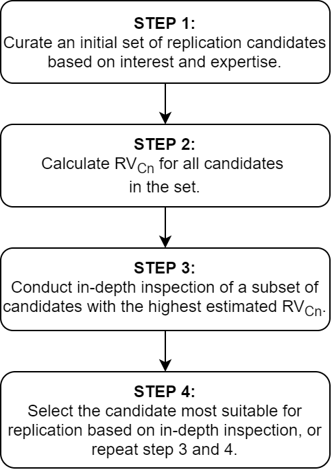

```{r setup, include = FALSE, echo=FALSE, warning=FALSE}
options(digits = 3)

library("papaja")
library(tidyverse)
library(gridExtra)
library(kableExtra)
library(knitr)


source("OSF_files/analysis/analyses.R")
data.raw <- readRDS("OSF_files/raw_data/articles.Rds")
data.all.raw <- readRDS("OSF_files/raw_data/studies.Rds")
```

# Introduction

Close replication of original research results is essential for ensuring that the results can be reliably produced by different researchers [@Poldrack2017]. The practice is especially important in subfields of social and cognitive neuroscience where correlations between brain activity and behavioral outcomes are often of primary interest. These research designs tend to be highly vulnerable to error-rate-inflation and overestimation of effect size due to a combination of (1) low statistical power [@Szucs2017], (2) substantial researcher degrees of freedom [@Carp2012; @Botvinik-Nezer2020], and (3) incentives to publish statistically significant results [@Button2013]. In addition, neuroimaging research is generally vulnerable to generalizability issues that arise as a result of the complicated measurement pipeline. Unsurprisingly, rates of successful replications in the field are low [@Boekel2015]. And yet, close replications – which protect against persistence of false-positives – are not common practice [@Poldrack2017; @Huber2019; @Ashar2021]. As a consequence, many original studies are currently in need of replication. At the same time, the costs of data collection – and, by extension, replication – is high [@Poldrack2017]. With limited resources and many non-replicated studies to choose from, the field should consider which studies in the published literature would be the most important to replicate, so that resources directed towards replication can be spent optimally. 

Various formal strategies for replication study selection have been developed in recent years [@Field2019; @Matiasz2018; @Isager2021; supplementary formula documents in @Isager2020]. If effective, such strategies have a great potential for increasing the transparency and efficiency of replication study selection in neuroimaging research. When criteria for study selection are made transparent, it becomes easier to discuss which replication studies are worthwhile to fund, conduct, and publish. Additionally, when important-to-replicate targets can be identified more easily the overall contribution of replication as a research activity increases. By increasing the efficiency of coordination and resource spending in replication research, formal study selection strategies present a major step forward towards the important goal of making replication part of mainstream research practice [@Zwaan2018]. 

However, no formal study selection strategy has been tested for application in social neuroscience (or any other field for that matter). To be applicable, a strategy must meet two basic conditions. First, it must be feasible to apply the strategy in practice. That is, the information needed to execute the strategy must be possible to obtain given reasonable time and resource constraints. Most formal study selection strategies are based on a combination of statistical, bibliometric, and substantive information about the candidate replication targets, which is often not easy to access [e.g., @Tay2020; @Sullivan2012; @Furukawa2006; @Glasziou2008; @Federer2018]. The feasibility of existing strategies for application in any particular area of research is therefore uncertain. Second, provided that the strategy is feasible to apply we must validate that the strategy is actually helping us reach our prespecified research goals. All feasible selection strategies lead to *some* prioritization of replication targets, but whether prioritized targets truly are those more in need of replication is an empirical question. 

In this article we explore how to apply a particular study selection strategy [@Isager2021] to fMRI research in social neuroscience. Because a strategy must be feasible to apply before it can be validated, we focus mainly on the issue of establishing the feasibility of selection strategies. By *establishing feasibility* we simply mean that we will explore whether a certain strategy can be carried out in practice (can we identify the set of replication targets, can we collect reliable estimates of the necessary data, and so on) given reasonable time- and resource constraints. We also provide a brief qualitative assessment of the targets recommended to us by the strategy, noting potential issues that future validation studies may want to examine more carefully. 

The immediate goal in this article is to understand how best to implement this strategy in social fMRI research so that the strategy can be validated for use in this field and potentially used for efficient study selection by future researchers. However, our implementation efforts could also be used as a framework to test the feasibility of alternative study selection strategies [e.g., @Field2019]. In addition, we aim to curate and openly share a large dataset of metadata about empirical studies from the social fMRI literature that could form the basis for any replication study selection in this field, regardless of the selection strategy utilized. Finally, by exploring the range of information relevant to replication study selection in social fMRI, we hope to leave researchers in this field better equipped to make well-informed decisions about which original research to prioritize for replication. 

# A four step approach to selecting studies for replication

To decide on a method for replication study selection, we must first settle on a goal, and a rationale for why selecting certain studies helps us reach this goal more efficiently. We here adopt the formal decision model for replication study selection proposed by @Isager2020. According to this model, the goal of a replication effort is to maximize the *expected utility* of knowledge gained. *Expected utility gain* can be approximated by the *replication value* of the target claim we want to replicate. Replication value is a function of the *value* of having accurate knowledge about the replication target, and our *uncertainty* about the truth status of the target based on available evidence prior to replicating. Research claims that are highly valuable, and about which we are highly uncertain, will have a high replication value, and should be prioritized for replication in order to maximize expected utility gain.

We have previously proposed an operational definition of replication value [@Isager2021], in which value is operationalized as the average yearly citation impact of the article in which a claim is reported, and uncertainty is operationalized as the sample size used to investigate the claim. Replication value is then operationalized as the indicator *RV~Cn~*:

\begin{equation} 
  \tag{1}
  RV_{Cn} = value\times uncertainty = \frac{w(C_{S})}{Y+1}\times\frac{1}{\sqrt{n}}
  (\#eq:1)
\end{equation}

where $RV~Cn~$ denotes a particular operationalization of replication value, $C$ stands for citation impact, $n$ stands for the total number of participants included in the study, $w()$ stands for the weighting function that should be applied to the citation impact, $s$ denotes the source the citation data is retrieved from, and $Y$ stands for the age of the article in years. The equation assumes that average yearly citation impact is causally influenced by scientific impact, which itself is a determinant of the value of a replication target. Sample size (partially) determines the standard error of relevant parameter estimates, which in turn is a determinant of the uncertainty about a replication target.

A four-step procedure for replication study selection based on *RV~Cn~* is then proposed (see figure 1). First, an initial set of replication candidates is identified based on the research interests and resource constraints of the replicating researcher. As with every systematic review of the literature, the scope needs to be broad enough to encompass all claims of interest to the researchers, but narrow enough so that the review process becomes feasible. Second, *RV~Cn~* is calculated for each replication target included in the set to create an initial estimate of rank-order expected utility gain. Third, some subset of the targets with the highest *RV~Cn~* is inspected in-depth. This step functions to quality-control *RV~Cn~* estimates, evaluate a broad range of factors relevant to value and uncertainty [e.g., @Field2019; @KNAW2018; @Heirene2021], and consider feasibility given available resources. Similarly, the ability of the planned replication study design to reduce uncertainty should be considered for each candidate during this step [@Isager2020]. Fourth, once the researcher feels they have sufficient knowledge to make an informed choice, the candidate deemed most worthwhile to replicate is selected. Alternatively, if the researcher thinks no candidate would be worth replicating upon closer inspection, step 3 and 4 can be repeated for the remaining candidates in the larger set. 

{width=50%}

# Exploring the feasibility of using *RV~Cn~* for study selection in Social Neuroscience

*RV~Cn~* represents a promising step towards more efficient coordination of replication efforts in social fMRI research. However, it is not clear whether *RV~Cn~* is feasible to apply for study selection in social fMRI. The current report aims to address the many practical questions related to application of *RV~Cn~* that are currently unresolved. How can we determine an initial set of replication candidates? Does it matter from which source we collect citation impact information? Can we code sample size for all candidates in a feasible and reliable way? What additional insights could be gained about expected utility gain from the in-depth evaluation process that follows quantitative ranking?

Our exploration focuses on the first two steps of the four-step procedure listed in figure 1. We report the results of our attempt to implement these steps in practice, including our method for collecting a sample set of replication candidates (step 1), our method for collecting the citation impact and sample size data necessary to calculate *RV~Cn~*, the reliability of our methods for generating accurate citation count and sample size estimates, and the distribution of *RV~Cn~* for our set of candidates (step 2). In supplementary materials we also briefly summarize unsuccessful pilot efforts to identify and collect additional quantitative information for the candidates in our set. Finally, we also provide a brief qualitative evaluation of the recommendations produced by *RV~Cn~* to better understand what sort of studies are being recommended, and to get a sense of what factors one might want to consider in a comprehensive implementation of step 3. We end the article by generating hypotheses and offering suggestions for studies that could be undertaken to test the validity of *RV~Cn~*, having established that it can feasibly be calculated in social fMRI research. 

## Step 1 - Determining an initial set of candidates

### Eligibility criteria

To test the feasibility of calculating *RV~Cn~* we first set out to determine a suitable set of candidate articles given our interest to perform a replication in social neuroscience. We would prefer if this replication effort would be focused on studies that would be highly worthwhile to replicate, yet reviewing the entire literature is not feasible. We restricted our search for replication targets to fMRI research within social neuroscience, placing no further restrictions on topics and subfields of interest. We further restricted our candidate set based on article age. We reasoned that recently published empirical research will have exerted less of its full potential impact on the field compared to older research, such that a replication of recent research will more likely be conducted “in time” to still prevent unproductive follow-up research (when the original research is non-replicable) and stimulate productive follow-up research (when the original research is replicable). We therefore restricted ourselves to articles published in the last eleven years (2009-2019 at the time this decision was made).

Social fMRI articles were collected using two separate search strategies which we further detail below. From this initial set of articles we then excluded articles we did not believe would be feasible for us to replicate given our expertise and available resources, which meant excluding animal model research, highly invasive study designs, imaging methods outside our area of expertise, research on patient groups, etc. Since we did not know all the reasons why a study might not be possible for us to replicate, exclusion criteria were not predetermined, but were exploratorily derived through inspecting keyword information in our initial candidate set. To ensure transparency a written record of the decision rationale for each excluded keyword has been made openly available on OSF (https://osf.io/mtx72/). \

\

### Search strategy

We used the Web of Science (WoS; www.webofknowledge.com) database to construct our candidate dataset. WoS does not have a predefined field category for social neuroscience. To identify articles related to social neuroscience, we implemented a two-pronged search strategy. We first identified four journals in the WoS database as social neuroscience journals (Social Cognitive and Affective Neuroscience; Social Neuroscience; Behavioral Neuroscience; and Socioaffective Neuroscience Psychology). Empirical articles published in these journals were identified by submitting the following search term to Web of Science:

>(SO=(social neuroscience OR social cognitive and affective neuroscience OR behavioral neuroscience OR socioaffective neuroscience psychology) AND PY=( 2019 OR 2009 OR 2018 OR 2017 OR 2016 OR 2015 OR 2014 OR 2013 OR 2012 OR 2011 OR 2010 )) AND DOCUMENT TYPES: (Article)
	Timespan: 2009-2019. Indexes: SCI-EXPANDED, SSCI, A&HCI, CPCI-S, CPCI-SSH, ESCI.
	
The search was conducted on 2019-02-21. `r sum(data.raw$source=="searchterm")` articles were identified via this search strategy.

Searching only field-specific journals is bound to miss many important articles published in general topic journals such as PLOS ONE, PNAS or Neuroimage. To identify social neuroscience articles in other journals we also searched the entire WoS database for articles containing the keywords “social” and “fMRI” in either title or abstract. Empirical articles containing the relevant keyword information were identified by submitting the following search term to WoS:

>ALL FIELDS: (fmri AND social)
Refined by: DOCUMENT TYPES: ( ARTICLE )
Timespan: 2009-2019. Indexes: SCI-EXPANDED, SSCI, A&HCI, CPCI-S, CPCI-SSH, ESCI.

The search was conducted on 2019-02-21. `r sum(data.raw$source=="journal")` records were identified via this search strategy. 

\

### Selection process

Unsurprisingly, the two search strategies yielded overlapping results, as articles published in the four social neuroscience journals we identified also frequently contained the keywords “social” and “fMRI”. After removing duplicate records, the two search strategies yielded `r length(unique(data.raw$DI))` unique empirical articles in total (see figure 2). Basic bibliometric information about each article, including author-provided keywords, were downloaded for all articles.

Authors PMI and AvtV reviewed the initial set of articles and determined for each article whether author-provided keywords  indicated that replication would require access to samples or equipment that would not be feasible for us to obtain (the complete list of excluded keywords, categories, and exclusion rationales can be found at https://osf.io/mtx72/). All articles whose keywords, titles or abstracts matched keywords in our list were excluded. Our final set of candidates contained `r nrow(data.bib)` empirical articles. These articles were considered our initial candidate set. 


### Exploration of sample representativeness

Once the final set of candidate records was determined, we explored the available bibliographic information to ensure that the sample indeed seemed representative of the field of social fMRI research. To verify that the initial candidate set curated was representative of the population we wanted to sample from, two complementary validating questions were explored. First, does the sample adequately sample the strata of our population of interest? That is, are research topics and themes common in the population represented in the sample, and does the sample seem sufficiently diverse in terms of topics, themes, and subfields, given our expectation of diversity in the population sampled from? Second, does the sample contain strata from populations we did not intend to sample from? That is, are topics and themes prevalent in the data that obviously do not belong in the research field we are trying to sample from? 

To address these questions we explored a number of bibliometric indicators of the research topics contained within a set of articles, including (1) the journals in which articles in the initial set were published, (2) the WoS field categories [@zotero-3943] assigned to articles in the initial set, and (3) topic-related keyword information gathered from the articles themselves. The following sections summarize the analyses of each indicator in turn.

The analyses reported in the following sections only summarize a subset of all bibliometric information available for our initial candidate set of articles. Additional information includes all WoS Core Collection fields, the open access status of each article, and a range of citation metrics. The full dataset, including all bibliometric variables and a variable codebook, are available on OSF (https://osf.io/f7zdq/). 

#### Distribution of articles over journals

We explored the distribution of journals in our data, including the topic specializations implied by the journal titles and the frequency with which articles were published in each unique journal. We addressed our two validating questions by examining (1) whether there was a substantial spread of articles over general and specialty journals, as we would expect in a sample of social fMRI articles, (2) whether journals known to be prevalent in social fMRI research were frequently published in, and (3) whether journals obviously not related to social neuroscience research were infrequently published in.

The records included in our dataset were published in `r n.journals` unique journals, consistent with our expectation that social neuroscience is a broad and loosely connected discipline of researchers from many subfields, who publish in a variety of specialty- and general-topic journals. Table 1 displays the name and frequency of the 20 journals most frequently published in (`r perc.articlesintopjournals` of all articles in the set were published in these 20 journals). Unsurprisingly, two of the four social neuroscience journals targeted by our search strategy were also among the most prominent journals in the candidate set (Social Cognitive and Affective Neuroscience, and Social Neuroscience). As to why the other two preselected journals were not featured, the journal “Socioaffective Neuroscience & Psychology” only contributed 19 articles to the initial candidate set, of which 17 were excluded based on keyword information. The journal “Behavioral Neuroscience” contributed 810 articles to our initial candidate set, of which 805 were excluded based on keyword information. Besides the preselected journals, the sample appeared to be dominated by journals that were either general-topic (PLOS One and PNAS) or general neuroscience/psychology (e.g. Neuroimage, Frontiers in Psychology, Cortex), which is broadly in line with our expectations about which journals ought to be prevalent in social fMRI research. 

Inspecting the full distribution of unique journal names yielded similar observations. Most journals appeared to be either specialty journals within various subfields of psychology and neuroscience or general topic journals whose field of interest might plausibly overlap with social neuroscience research. Only a small minority of journals seemed clearly outside the normal scope of social fMRI research (ACM Computing Surveys, Physical Review E, The Accounting Review, as well as a small number of journals dedicated to statistics). 

```{r tab1}
apa_table(jou.freq, caption = "\\textbf{Table 1:} Journals which the articles in our initial candidate set were most frequently published in.", escape = F)
```

#### Distribution of articles over Web of Science field categories

We explored the distribution of WoS field categories linked to our data, including the range of categories mentioned and the frequency of each category. We addressed our two validating questions by examining (1) whether a substantial spread of categories from psychology and neuroscience were covered, as we would expect in an interdisciplinary research field, (2) whether categories expected to be prevalent in social fMRI research were frequent in our dataset, and (3) whether categories obviously not related to social neuroscience research (e.g. “engineering, petroleum”) were infrequent in the data.

The records in our dataset were classified as being members of `r n.woscats` unique WoS categories. Table 2 displays the name and frequency of the 20 WoS categories most frequently tagged (`r perc.articlesintopwoscats` of all articles in the set were sorted under these 20 Web of Science categories). This distribution is largely consistent with what we would expect to see in studies sampled from social neuroscience research, with many categories covered and with categories such as “Neurosciences; Psychology; Psychology, Experimental” and “Multidisciplinary Sciences” being among the most common. However, it is somewhat surprising that categories such as “Psychology, Social” and “Neuroimaging” are not more prevalent in a dataset that is supposed to contain fMRI studies of social psychological phenomena.

Inspecting the full range of WoS category labels yielded similar observations. Most labels were clearly related to areas of behavioral science, psychiatry, neuroscience and biology, consistent with the interdisciplinary branches of social fMRI research. Only a few category labels seemed obviously unrelated to social neuroscience (“Engineering, Mechanical, Information Science & Library Science”, “Ophthalmology”, “Physics, Fluids & Plasmas; Physics, Mathematical”, and “Urology & Nephrology”). Of the articles sorted under these categories in our data, only one article [@Colman2015] seemed truly unrelated to social neuroscience on closer inspection. 

```{r tab2}
rownames(field.freq) <- c()
apa_table(field.freq, 
          caption = "\\textbf{Table 2:} Web of Science field categories most frequently tagged in our initial candidate set.", 
          escape = F, 
          font_size = "small", 
          align = c("m{11cm}", 
                    "m{1.5cm}"))
```

#### Frequently co-occurring article keywords

Journal- and WoS category information encodes the research topics covered in our candidate set on a course level, since any journal or field category could include a wide variety of research topics (e.g., research topics as diverse as empathy, face perception, peer influence, and working memory all feature in the latest journal issue of Social Neuroscience; Vol 16, issue 3). To supplement the preceding analyses of journal and WoS field categories with more fine-grained information, we utilized the statistical visualization software VOSviewer [@VanEck2010] to extract commonly mentioned terms from the titles and abstracts of all studies, and we studied whether terms co-occurred in line with our prior knowledge of terminology in different subfields of social neuroscience. Additional analyses of keywords retrieved from the Centre for Science and Technology Studies (CWTS, https://www.cwts.nl/) are reported in supplementary material SM1.

All data included in the initial candidate set were subjected to analysis in VOSviewer (co-occurrence map with parameters set to binary counting, minimum number of occurrences set to 15, maximum number of keywords set to 200. Age-related and generic terms were excluded. The list of excluded keywords and map files to recreate the reported co-occurrence map can be found on OSF: https://osf.io/f7zdq/). Figure 3 displays the co-occurrence map between commonly mentioned keywords in our dataset (online interactive version of the figure: https://bit.ly/3yDPMup). 


The VOSviewer co-occurrence map corroborates the findings of the previous analyses. Themes commonly studied in social neuroscience frequently co-occur in the titles and abstracts of articles in our data. Further, it seems that individual topics could be organized into larger categories based on keyword co-occurrence clusters [represented as keyword colors in figure 3; @VanEck2014]. As expected from a set of articles sampled from social neuroscience, these categories center around themes such as face perception (purple cluster), judgement and decision-making (green cluster), language (red cluster), and social pain/ostracism/exclusion (blue cluster). The default mode network (yellow cluster) also has clear ties to social neuroscience research [@Li2014].

### Overall evaluation of step 1 implementation

Converging lines of evidence suggest that our search strategy and selection process was successful in curating a dataset both representative of, and exclusive to our target population of healthy human social fMRI research. Note that our sampling and selection process was largely constructed to overcome the problem that social fMRI is not a well-defined bibliometric category. Determining an initial set of candidates will likely be more straightforward when the field of interest aligns more closely with a well-defined bibliometric category (e.g., a WoS field category). 


## Step 2 - Deriving quantitative replication value estimates

Having determined a set of candidate articles to consider for replication, we next set out to quantitatively estimate the replication value for each replication target in this set (see figure 1, step 2). Following @Isager2021 we chose *RV~Cn~* as our operationalization of replication value (equation 1). This means we operationalize value as a function $w$ of target article citation impact $C$ derived from a particular source $S$, divided by publication year ($Y$). We operationalize uncertainty as the sample size ($n$) of the target study. 

### Operationalizing value as citation impact

In practice, we need to specify what function w, type of citation impact $C$, source $S$, and sample size $n$ we intend to use for calculating *RV~Cn~*. To examine the impact of choosing one specification over another, we studied the reliability of citation impact estimates across a range of impact types $C$, sources $S$, and functions $w$. Two qualitatively different types of citation impact C were collected; traditional academic citation indexes and Altmetric attention scores. Altmetric attention scores were collected using the *rAltmetric* package in R [@Ram2017; download date: 2020-10-30]. Altmetric attention scores are a weighted count of news- and social-media attention an article has received [@2021]. For traditional citation impact, we collected data from multiple sources, including WoS (collected 2020-11-07 using the WoS web interface), Crossref [collected 2020-10-30 using the rCrossref package in R; @Chamberlain2020], Scopus [collected 2020-10-30 using the rScopus package in R; @Muschelli2019], CWTS (collected 2020-10-28 from the CWTS database by author TvL), and scite™ (www.scite.ai; obtained 2021-08-23 by scite™ staff on request). WoS, Crossref, Scopus and scite™ citation counts are all unweighted raw counts of incoming citations of an article. CWTS citation counts consist only of incoming citations that are not self-citations. We also collected field- and age-normalized citation counts from the CWTS database [for details about the normalization procedure, see @Waltman2011]. Thus, our data contained three different functions $w$ of citation impact (raw count, self-citations subtracted, and field/age-normalized). Publication year data $Y$ was collected from the WoS database. 

### Operationalizing uncertainty as sample size

Following the rationale of @Isager2021, we operationalized the uncertainty about a claim before replication in terms of the standard error of effects supporting the claim, which we then approximated as the sample size of the study in which the claim is reported. Sample size was here defined as the total number of participants in a study for which fMRI data was reported (i.e., the number of participants that were not excluded from all fMRI analyses). Sample size was manually coded by undergraduate students at Leiden University and Eindhoven University of Technology.

We originally aimed to collect additional information about uncertainty (e.g. information about statistical analyses, experimental design, whether the study was exploratory or preregistered, number of existing replications, etc.) that could be used to derive alternative operationalizations of replication value. We subsequently planned to compare estimates from the *RV~Cn~* indicator with other proposed indicators of replication value [e.g., @Field2019, which requires information about bayes factors]. However, following two pilot studies aimed at identifying additional uncertainty information (see supplementary materials SM2 and SM3), we concluded that additional information relevant to uncertainty-assessment in social fMRI would not be feasible for us to collect. The primary reason for this was the difficulties we faced in identifying the main finding of interest in each study, which would be necessary in order to know what test statistics, design features, replication studies etc. would be relevant for the replication target. The secondary reason was that, even if a main finding could be identified, both finding the corresponding result and finding a consistent method of reporting results across the field was difficult. In the end, sample size was the only operationalization of uncertainty we were able to move forward with in this study. 

### Collecting and inspecting the reliability of *RV~Cn~* input

In exploring how *RV~Cn~* should be calculated based on the quantitative information listed above we first studied the reliability of citation impact estimates across sources and weighting schemes to gauge how much these factors matter for the final citation impact estimate. Second, we considered the influence of age on citation impact, and we estimated how well this influence is mitigated by dividing citation impact by article age. Third, we explored the feasibility and reliability of coding sample size for target studies in the candidate set. Finally, based on the preceding analyses we designed two alternative replication value indicators and examined the divergence in their respective estimates.

#### Reliability of citation impact across sources

To better understand the reliability of citation impact $C$ across sources $S$, we explored the strength of association between a variety of citation metrics (table 3). 

```{r tab3}
pander(t.cit.metrics, caption = "\\textbf{Table 3:} Frequency of various citation metrics available for our data. Web of Science citation counts were originally available for all articles, but some could not be retrieved when the citation count data was updated in 2020.")
```

All metrics were retrieved within a timespan of two weeks to ensure that there would be no differences in citation impact from different sources due to time-lag. Due to the skewed distribution of all citation metrics, and because we are primarily concerned with the rank-ordering of the records [@Isager2020] Spearman’s rho correlation was used to assess the strength of association between metrics. 

In addition, we expected WoS, Crossref, Scopus, CWTS, and scite™ counts to be highly correlated measures of the same underlying construct - the raw academic citation impact of an article. To test this expectation, we subjected the citation data from these sources to an intraclass correlation analysis [model = two-way fixed effects, type = single rater, definition = consistency; @Koo2016] using the ICC function in the R package *psych* [@Revelle2021; ICC3 output reported].

```{r fig4, fig.cap="**Figure 4.** Density distribution of citation metrics. **A)** The distribution of raw citation counts from Web of Science (black), Crossref (red), Scopus (blue) and CWTS (orange). **B)** The distribution of CWTS citation impact, normalized by research field/cluster. **C)** The distribution of Altmetric attention scores.", warning=FALSE}

grid.arrange(g.raw, g.tncs, g.alt)
```

Figure 4 displays the distributions of all citation metrics. All metrics are heavily right skewed. The distributions of raw citation counts are highly overlapping across sources (Figure 4A). CWTS citation counts are more heavily skewed towards zero than raw counts from other metrics, likely due to the fact that CWTS subtracts self-citations from the total citation count.

```{r fig5, fig.cap="**Figure 5.** Matrix of bi-variate correlations between the citation metrics available for the articles in our dataset. ", warning=FALSE}

corrplot(corr = cor.mat.citations,
         method = "color",
         col = col(200),
         addCoef.col = "black",
         tl.col="black",
         tl.srt=45,
         diag = F)
```

Figure 5 displays the rank-order correlations between various citation metrics. The correlation between raw citation counts from any two sources was very high (always >`r min(cor.mat.citations[1:4, 1:4])`). The inter-rater reliability between these metrics was similarly high, ICC = `r icc.cit$results[3, "ICC"]`, CI95%[`r icc.cit$results[3, "lower bound"]`, `r icc.cit$results[3, "upper bound"]`]. Even though self-citations are subtracted from CWTS citation counts, these scores were only marginally less correlated with scores from the three other sources, compared to intercorrelations between the other sources. 

As expected based on the prior literature [@Costas2015] the correlations between Altmetric scores and all other metrics were consistently quite low. The correlation between normalized and non-normalized citation counts was consistently high across sources, though substantially lower than the inter-correlation between different raw citation counts. This suggests that it matters little for *RV~Cn~* estimates which source $S$ is used, but it does matter whether one chooses raw or field-normalized citation count as the operationalization of $w(C)$, and it would matter substantially whether one chooses to use traditional citation count or news/social-media impact as the operationalization of $C$. The reliability of Altmetric attention scores as estimates of news/social-media impact remains unclear, as we had no other metrics for this kind of impact to compare against. 

#### Accuracy and unbiasedness of average yearly citation count.

The target citation metric of *RV~Cn~* is the number of *future* citations an article will receive [@Isager2021]. Total citation count is a problematic estimator of future citation impact because citations accumulate over time, which means that as an article gets older it will tend to get a higher total citation count regardless of expected future citations. To prevent systematic measurement error due to age, *RV~Cn~* uses the average yearly citation count instead of the total count as an operational measure of value. 

To examine how well average yearly citation count predicts future citation count we obtained the yearly citation rate for each article in our dataset from scite™. Then, using the average yearly citation count of each article from using all years until 2019, we predicted the citation rate of each article in our data for year 2020 (the last complete year in the data). To examine whether average yearly citation count avoids systematic age bias we examined the correlation between age and average yearly citation count. In addition, we explored the relationship between age-averaged citation count and age/field-normalized CWTS citation count, which are age-adjusted using the superior method of normalizing the citation count against all articles from the same year. If age-averaging is an effective method for age adjustment, age-averaged citation count should correlate more strongly with CWTS normalized scores than raw citation count. Finally, we also examined the effect of age-averaging on Altmetric attention scores. 

We focus on scite™ citation count data in these analyses since it was the only source from which we could obtain data on yearly citation rate. However, the reported pattern of results is highly similar regardless of which citation source is used (see supplementary material SM4). 

##### Predictive accuracy

```{r fig6, fig.cap="**Figure 6.** **A)** Citation trajectories for all articles in the dataset. **B)** Log citation trajectories, with box plot summaries for each year. **C)** Citations obtained in 2020 predicted by the average yearly citation count from the articles publication year until 2019. ", warning=FALSE}

lay <- rbind(c(1,2),
             c(3,3))
grid.arrange(p.traj_raw, p.traj_log, p.c2020_by_cy1, layout_matrix = lay)
```

Figure 6A displays the scite™ citation rate trajectory for all articles in our data. Figure 6B displays the same trajectories on a log+1 scale with box plots summarizing the distribution for each year since publication, which gives a better sense of the overall trend. On average, most articles seem to be cited at an increasing rate for about the first two years since publication. Then the trajectory flattens, possibly increasing slightly around year ten. Given this general trend, we would expect average yearly citation count to be a fairly good predictor of future citation impact, but it will suffer from the fact that it includes citations from the two first years, which consistently underestimate the citation rate in later years. This is also what we find in the data.

Figure 6C displays the accuracy of average yearly citation count (using data until 2019) for predicting the “future” citation count in 2020. Predictive accuracy is quite good, but far from perfect, $\rho$ = `r c2020_by_cy1$estimate`, CI95%[`r c2020_by_cy1$conf.int[1]`, `r c2020_by_cy1$conf.int[2]`]. As expected, average yearly citation count consistently underestimates how many citations are obtained in 2020. The two first years since publication are included in the average yearly citation count, which tends to drag down the average. Also as expected, Underestimation of citations in 2020 seem to be particularly severe for more recently published articles. The younger the article, the more its average yearly citation count is influenced by the two first years since publication. 

Because total citation counts obtained from scite™ were highly correlated with total citation count obtained from other sources, we believe the results reported here likely generalizes to citations from WoS, Crossref, Scopus, and CWTS. 

The results suggest that the predictive accuracy of *RV~Cn~* could be improved by excluding citations from the first two years since publication. Alternatively, accuracy could be improved through more accurate modeling of each article’s citation trend. However, such improvements require data on citations per year, which is not easily accessible to most researchers.

##### Predictive unbiasedness

Article age was very weakly correlated with scite™ citation rate at year 2020, $\rho$ = `r c2020_by_age$estimate`, CI95%[`r c2020_by_age$conf.int[1]`, `r c2020_by_age$conf.int[2]`], suggesting age since it carries little information about future citation rate and it is appropriate to correct for it. To examine how well age-averaging corrects citation estimates for age, we computed pairwise spearman correlations between publication age, scite™ citation count, Altmetric scores, scite™ citation count divided by years since publication, Altmetric scores divided by years since publication, and CWTS normalized citation count.

```{r fig7, fig.cap="**Figure 7.** Matrix of bi-variate correlations between age and citation indices.", warning=FALSE, echo=FALSE}

corrplot(corr = cor.mat.age,
         method = "color",
         col = col(200),
         addCoef.col = "black",
         tl.col="black",
         tl.srt=45,
         diag = F)
```

Figure 7 displays the correlation coefficients between all variables of interest. As expected, there was a strong correlation between age and raw scite™ citation count, $\rho$ = `r cit_by_age$estimate`, CI95%[`r cit_by_age$conf.int[1]`, `r cit_by_age$conf.int[2]`]. The correlation between citations and age dropped substantially when citation count was divided by years since publication. However, a small residual correlation between average yearly citation rate and publication age remains, $\rho$ = `r ycit_by_age$estimate`, CI95%[`r ycit_by_age$conf.int[1]`, `r ycit_by_age$conf.int[2]`]. This suggests that dividing total citation count by the number of years since publication is an imperfect age adjustment method. Averaging over age works best if citation time accumulates at a constant rate, but this rate is clearly *not* constant for most articles (figure 6A). Encouragingly, however, averaging citation count by age does increase the correlation between citation count and CWTS normalized scores, whose method of age correction is superior. Interestingly, even CWTS scores are weakly positively correlated with age, suggesting that perfect adjustment for article age is challenging. In summary, taking the average yearly citation count seems to be an imperfect but efficient method for age adjustment in traditional citation metrics.


#### Sample size inter-rater reliability

There does not, as far as we know, exist any tool for extracting sample size from research articles automatically. Applications such as Statcheck [@Nuijten2017] may allow for this in the future through detection of relevant degrees of freedom in articles. However, we were not able to utilize Statcheck for our data collection efforts because articles in our dataset rarely report statistics in the format required for the algorithm to work. Sample size for each study in our dataset was therefore coded manually. In this section we first report our procedure for extracting a subset of the full set of candidate articles for which sample size could feasibly be coded. We then report our procedure for coding the sample size of each study included in this subset. Finally, we report the results of an inter-rater reliability analysis designed to investigate the ability of coders to code sample sizes reliably and without error.

From the outset it was unclear to us how challenging it would be to code sample size information for the studies in our candidate set. However, manually coding sample size for all studies in the full set of `r nrow(data.bib)` candidate articles was assumed to be costly and time consuming from the outset. In lieu of prior information about the speed and reliability with which sample size can be manually coded, we tentatively aimed for a subset of 1000 coded studies. We sampled 1000 articles at random from the full set of `r nrow(data.bib)` articles and began the process of splitting these into individual studies for sample size coding. However, in the early stages of coding it became clear that many studies would have to be excluded due to not meeting our initial selection criteria upon closer inspection. To ensure that the final set of candidates would include at least 1000 studies, an additional sample of 500 articles were sampled at random from the full set. The exact code used to draw the sample is available on OSF (https://osf.io/rxukq/). After removing articles that matched our initial exclusion criteria [e.g., single non-fMRI studies from multi-study articles, such as @DeVries2018, study 4] the sample size was coded for each fMRI study in the article.

Coding was primarily performed by a team of three undergraduate research assistants. For each article we identified the number of studies reported in the article. For each study we recorded the number of participants who contributed any fMRI data to analyses reported in the study (even if their data were excluded from some analyses). We did not code more detailed sample size information such as the number of stimuli and trials used in each study. Although such information is obviously important for accurate estimation of overall statistical uncertainty [@Westfall2014] piloting efforts suggested it would be too difficult to extract this information for over 1000 studies. For further details about how coders were instructed to proceed with sample size coding, see the supplementary coding instructions (https://osf.io/j3pxf/).

The 1500 articles contained `r nrow(data.all.raw)` individual studies, of which `r sum(data.all.raw$excluded, na.rm = T)` matched our exclusion criteria. The final dataset contained `r nrow(data.all)` individual studies from `r length(unique(data.all$DI))` unique articles. On average, coders reported that coding the sample size of a single article would take a few minutes, but time taken was not normally distributed. Most studies could be coded in only a minute or so when sample size and exclusion criteria were clearly summarized in either the study abstract or the “participants” subsection of the methods section. A smaller subset of studies would take several minutes to code, usually because study authors would not report sample size clearly, or would not report clearly if data were excluded, meaning the entire methods and results sections would have to be read before sample size could confidently be coded. 

Manual coding introduces human error. In addition, discrepancies between coders can emerge when it is not clear whether participants should be excluded from a study, whether a study should be excluded from the candidate set, etc. In order to ensure that sample size estimates were reliably coded, a subset of `r nrow(data.irr)` studies, randomly selected from the larger set of `r nrow(data.all)`, were double-coded by independent coders and subjected to an inter-rater reliability analysis. Two additional coders (one additional undergraduate student - the undergraduate coder - and the first author - the PhD coder) re-coded the sample size for each study in this subset. While coding, all coders were blind to the sample size provided by other coders. To study inter-rater reliability, we subsequently calculated the percentage agreement between each of the coders, and we calculated the intraclass correlation coefficient between coders (model = one-way fixed effects, type = single rater, definition = absolute agreement) using ICC function in the R package *psych* (ICC3 output reported).

```{r fig8, fig.cap="**Figure 8.** Variation in sample size between coders. Sample size is plotted on log scale. The original sample size coded is represented on the x-axis. Double-coded sample size values are represented on the y-axis. Blue circles represent values from the PhD-student coder. Brown triangles represent values from the undergraduate student coder.", warning=FALSE}

plot(g.irr)
```

Overall, there was a high but imperfect agreement between the three coders (percentage exact agreement = `r all.match`). The undergraduate double-coder and the PhD coder had a slightly higher agreement rate (percentage exact agreement = `r BA.PhD.match`) than either one had with the original undergraduate coders (percentage exact agreement between original coders and undergraduate coder = `r orig.BA.match`, percentage exact agreement between original coders and PhD coder = `r orig.PhD.match`). The intraclass correlation coefficient between raters was high, ICC = `r icc.n$results[3, "ICC"]`, CI95%[`r icc.n$results[3, "lower bound"]`, `r icc.n$results[3, "upper bound"]`]. Figure 8 displays the variation in sample size between the coders, plotted on log scale.

Coders disagreed in `r sum(data.irr$matches_BA_PhD==0 | data.irr$matches_orig_PhD==0 | data.irr$matches_BA_PhD==0)` cases. All disagreements between coders were resolved by the PhD coder after inspecting comments by the other coders. In most cases, one coder was clearly correct and the other clearly incorrect. In cases where the correct sample size was genuinely ambiguous (e.g., when study exclusion procedures were not clearly explained) the PhD coder had final say in which sample size would be considered correct. In addition to the cases of disagreements identified in the data used for inter-rater reliability analysis, one additional sample size coding error in the full set of `r nrow(data.all)` studies was detected and corrected at a later time during the analyses. Figure 9 displays the distribution of sample size in our data after resolving coder disagreements (mode=`r mode.samplesize`, median=`r median.samplesize`, frequency of *n<=10*=`r zerototen`, *11-20*=`r tentotwenty`, *21-30*=`r twentytothirty`, *31-40*=`r thirtytofourty`, *41-50*=`r fourtytofifty`, *51-60*=`r fiftytosixty`, *61-70*=`r sixtytoseventy`, *71-80*=`r seventytoeighty`, *81-90*=`r eightytoninety`, *91-100*=`r ninetytohundred`, *n>100*=`r overhundred`).

```{r fig9, fig.cap="**Figure 9.** Distribution of sample sizes in the dataset. For visualization purposes, the x-axis limit is set to n=500, excluding 10 cases where n>500.", warning=FALSE}

plot(g.samplesize)
```

### Calculating and comparing alternative operationalizations of *RV~Cn~*

Having established that accurate citation count and sample size estimates can be reliably collected, we proceeded with the actual calculation of *RV~Cn~* Reliability checks revealed that traditional citation counts were not strongly associated with Altmetric attention scores, regardless of citation source. Replicating researchers might justifiably want to use either or both of these metrics to estimate value. Therefore, we decided to compare the results of two alternative operationalizations of replication value; one indicator measured value via the Web of Science citation count of the articles (*RV~WoS~*), while the other indicator measured value via Altmetric score of the articles (*RV~Alt~*). Both indicators used sample size as a measure of uncertainty. Note that we could also construct and compare additional operationations based on these data, for example based on field-normalized citation impact or a combination of citation impact and Altmetric score, but for illustration purposes we here focus on the two least correlated value estimates. 

*RV~WoS~* was based on the equations derived by @Isager2021, and calculated in the following way:

\begin{equation} 
  \tag{2}
  RV_{WoS} = \frac{C_{WoS}}{Y+1}\times\frac{1}{\sqrt{n}}
  (\#eq:2)
\end{equation}

where $C_{WoS}$ denotes the Web of Science citation count of the article a study is reported in, $Y$ denotes the article age in years, and $n$ denotes the sample size of the study after exclusion.

*RV~Alt~* was calculated in the following way:

\begin{equation} 
  \tag{3}
  RV_{WoS} = C_{Alt}\times\frac{1}{\sqrt{n}}
  (\#eq:3)
\end{equation}

where $C_{Alt}$ denotes the Altmetric attention score of the article, and $n$ denotes the sample size of the study after exclusion. Because exploratory analyses revealed that Altmetric attention scores are not correlated with article age in our data, we did not average $C_{Alt}$ over publication year in this replication value indicator. Because Altmetric attention scores were not available for all reports in our dataset, $C_{Alt}$ could only be calculated for `r sum(!is.na(data.all$RV_alt))` of `r nrow(data.all)` studies.

Importantly, we calculated both *RV~WoS~* and *RV~Alt~* under the assumption that no study in our candidate set is a replication of another study in the set, implying that no studies should be combined in the estimate of n. This assumption is very likely false for some candidates, in which case it would have been more appropriate to combine the sample size from the original study and it’s replications [@Isager2021, supplementary material 1]. However, detecting such cases is extremely challenging because original and replicated studies are not linked in bibliometric records. Because lack of replication research in fMRI research [@Poldrack2017] implies that only very few articles in our dataset would be replications of one another, we found it acceptable to proceed with calculation under the assumption that there were no replications in the data. 

The distribution of replication value from both indicators was visually inspected, and estimates from both indicators were correlated to study their similarity. Spearman’s rho was used since rank-order correlation between different indicators is what matters for what decisions they lead to in practice. 95% bootstrap confidence intervals were calculated for the correlation estimate using the spearman.ci function of the RVAideMemoire package in R [@Herve2021].

```{r fig10, fig.cap="**Figure 10.** Scatter plot visualizing the relationship between *RV~WoS~* and *RV~Alt~*. Distribution of *RV~WoS~* estimates are visualized as bars on the x-axis. Distribution of *RV~Alt~* estimates are visualized as bars on the y-axis. Blue bars (and dots) represent the 10 highest *RV~Alt~* scores. Red bars (and dots) represent the 10 highest *RV~WoS~* scores. Purple dots represent scores that are among the 10 highest scores on both estimators. Two of the ten studies with the highest *RV~WoS~* scores are not included in the scatter plot because their *RV~Alt~* scores could not be computed due to missing Altmetric attention scores.", warning=FALSE}

plot(RVcor.p)
```

Figure 10 displays the distribution of *RV~WoS~* and *RV~Alt~* and their association. Overall, both distributions are highly skewed (see bars on axes in figure 10), which is expected given that sample size, Web of Science citation count and Altmetric attention scores are all highly skewed as well (see figure 4 and figure 9). Overall rank-order correlation between estimators was moderate, $\rho$ = `r RVcor$estimate`, CI95%[`r RVcor$conf.int[1]`, `r RVcor$conf.int[2]`]. Since our replication selection strategy involves selecting a study from the subset of the highest indicator-ranked studies, we also considered rank-order overlap between the two indicators for the highest-ranked studies from each indicator. Of the ten highest-ranked studies from each indicator, only two studies [@Tamir2012; @Kassam2013] were ranked among the top ten in both indicator rank-orderings (purple-colored points in figure 10). Besides these, these top ten studies based on *RV~WoS~* (red bars and points in figure 10) had substantially lower scores on *RV~Alt~* than the top ten studies based on *RV~Alt~* (blue bars and points in 9), and vice versa. This weak association between *RV~WoS~* and *RV~Alt~* is as expected. Traditional citation impact and altmetric attention scores are generally thought to measure different aspects of impact and are known to be weakly associated. 

In other words, quantitative recommendations for which studies to replicate will vary substantially based on whether traditional or altmetric citation impact is used to estimate replication value, because these impact metrics measure different attributes. To the extent that they measure scientific impact, they measure non-overlapping aspects of scientific impact. Different stakeholders may prefer either operationalization, depending on what aspects of impact they find most relevant. If a stakeholder has no preference, they should either combine both sources of impact in their estimate of $C$, or focus on studies with a high value on both indicators.

### Overall evaluation of step 2 implementation

In summary we return to the research questions posed in the introduction. First, does it matter from which source we collect citation impact estimates? It depends. For academic citation impact, exact count may vary between sources, but relative citation rank-order appears very reliable across sources. So long as the same source is used consistently for all replication targets evaluated, choice of source has little consequence. Field-normalizing citation counts seems to have a more substantial impact on citation rank-order, though correlation between raw and field-normalized counts was also quite high for our data. Altmetric attention scores are only weakly correlated with traditional citation counts,which has a substantial impact on *RV~Cn~* estimates. This is to be expected since Altmetric attention scores and traditional citation count metrics measure different value-related attributes, and it means that, in practice, researchers need to think carefully about which of these metrics more closely represents their personal definition of value. Finally, it seems that the recommendation to average citation impact over article age in the *RV~Cn~* estimate [@Isager2021] is an effective but imperfect method of adjustment for article age. However, depending on the citation metric chosen, averaging over age may itself introduce systematic measurement error in the scores. We therefore urge researchers to consider alternative age adjustment methods when these are available.

Second, can we code sample size for all candidates in a feasible and reliable way? Indeed it seems so. However, (1) this process was more challenging than we had first anticipated, (2) inter-rater reliability of manual coders is high, but not perfect, and (3) we were only able to code sample size coarsely as 'number of participants in study', omitting information often used in the calculation of the standard error such as number of trials and stimuli [@Westfall2014]. Our main obstacle in the coding process was the non-standardized reporting of participant exclusions, which we needed to derive the final sample size of the study design. Most often, exclusions and final sample size would be reported in the 'participants' subsection of the methods section. However, information about participant exclusions would frequently not appear until the results section. In several cases, exclusions would be reported in several places. For example, participants excluded after psychiatric assessment might be mentioned in the methods section, while participants excluded due to movement artifacts might appear as part of the reported results. Frequent inconsistencies like these meant that double-checking usually had to take place, which slowed down the coding effort and led to several coding errors. In the end, we were not able to code sample size for all studies in the entire set of `r nrow(data.bib)` articles given our time- and resource constraints, but a substantial subset could be coded by a small roster of undergraduate research assistants in less than 100 hours, all told. We estimate that the entire set could likely be coded in less than 200 hours. In cases where it is not feasible for researchers to carry out step 2 for the entire set of candidates derived in step 1 (see figure 1), randomly selecting a feasible subset of all candidates in step 2 seems to us a reasonable way to proceed, since it at least gives every candidate an equal chance of being evaluated further. Of course, alternative methods for narrowing down the candidate set could also be considered. A simple procedure would be to define the field of interest more narrowly than we did here, leaving fewer replication targets in the initial set of candidates to begin with. 


## Step 3 - In depth review of recommended candidates

To assess the face validity of *RV~WoS~* and *RV~Alt~* recommendations, we followed up the quantitative analyses with a brief qualitative review. The goal of this review was twofold. First, we wanted to see whether quantitative replication value estimates would conform to our own intuitions about replication value. Would it usually seem obvious to us that studies which received a high *RV~WoS~*/*RV~Alt~* estimate would be more worthwhile to replicate than studies that received a low estimate? Second, we wanted to diagnose potential sources of noise and systematic error in the replication value estimation procedure, leading to a high replication value estimate without actually warranting a replication (e.g., an article may be highly cited for reasons other than the empirical studies it reportes, by utilizing a novel method, espousing an ideological claim, etc.). Importantly, the goal of this section is not to identify targets for replication per se, because we are not yet confident that *RV~WoS~* and *RV~Alt~* are estimating replication value as intended during step 2. Rather, the goal is to identify potential issues with validity, reliability and measurement error that future validation studies of *RV~Cn~* may want to follow up on. Therefore, we do not commit to the same depth of qualitative analysis here that we would normally recommend during full-scale execution of step 3.

### Review procedure

Because *RV~WoS~* and *RV~Alt~* rank order was only moderately correlated with each other, we included the 10 highest and 10 lowest estimates from both indicators in our review. In addition, we included the 10 lowest non-zero estimates from the *RV~WoS~* distribution, because we suspected that *RV~WoS~* scores of 0 often simply reflect a paper too young to have picked up citations yet. In total, 44 unique studies were included in our face validity review (6 studies were among the highest or lowest scores for both indicators).

Since our goal was partly to explore what information might be important to consider in a full-scale qualitative review, formal review criteria were not established in advance. Authors PMI and AvtV read the title and abstracts of all studies included in the review, consulted the article text intermittently for clarifications, and reviewed quantitative information related to the replication value estimates of these studies (i.e., reviewers were not blinded to a record’s rank position). Both reviewers first made notes for each study in private, focusing on their intuitive validity judgement of the replication value estimate and on potential sources of error and bias. Notes were then discussed by PMI, AvtV, and DL in two meetings to distill the most central outcomes of the review effort. The full set of notes is available on OSF for author PMI (https://osf.io/vwpqs/) and AvtV (https://osf.io/953rh/).

### Central outcomes of the review process

The review process was completed in roughly one week. Due to issues with blinding, which are detailed below, we elected not to increase the sample of reviewed studies beyond the 44 initially reviewed. In future feasibility studies, and in a full-scale implementation of step 3, researchers may want to review a larger subset of candidates, which is of course possible so long as one has the time and resources available. It should be noted that a full-scale implementation of step 3 will likely involve a more in-depth review of each candidate than was conducted here, which would entail a much longer review process for the same number of studies. 

The face validity review led to three primary observations. First, detailed inspection of quantitative replication value estimates turned out to be highly important for quality control. We discovered two cases of erroneously coded sample sizes. In the one case, the correct sample size of 16 was coded as 1, likely due to a typographical error. In the other case, missing data exclusion was not taken into account and the coded sample size of 561 was corrected to 114. In addition to manual errors in sample size encoding, we noticed eight studies that were not obviously connected to social neuroscience, and one study that should clearly have been filtered out by our initial step 1 exclusion criteria because it did not utilize fMRI for imaging. Finally, in one case we had incorrectly labeled a single two-session repeated measures study as two separate studies. 

Second, correspondence between *RV~WoS~*/*RV~Alt~* rank order and our intuitions about the replication value of the claims (based on title and abstract information) was not immediately obvious. In some cases, it seemed natural to us that the studies estimated as having the lowest/highest replication value should belong to that group; in other cases it did not.  In hindsight, lack of blinding on part of the reviewers made interpretation difficult because it prevented unbiased interpretation of sample size and citation impact information during review. Normally, this information would have been natural to consider when forming an intuitive judgement about replication worthiness, but in the present analysis we could not consider it without confounding the comparison between formula estimates and intuitive judgements. Therefore, we cannot at present conclude whether lack of correspondence between intuition and formula estimates signals a problem with *RV~WoS~*/*RV~Alt~* or simply indicates that the assessment procedure is compromised.

Third, we discovered a number of potential sources of noise and systematic error in the *RV~WoS~*/*RV~Alt~* estimates during review (which may partly be responsible for the low perceived correspondence between indicator estimates and reviewer intuitions). The most obvious problem was the number of studies utilizing within-subject designs. Variation in study design leads to noisy estimation of true replication value, since both *RV~WoS~* and *RV~Alt~* exclusively use number of participants to estimate uncertainty and thus ignore reduction in uncertainty due to repeated measures of each participant. More problematic still, the use of within-subject designs seemed to be much more common among the highest ranked studies. This makes intuitive sense. A within-subject design is likely to require a lower number of participants on average than a between-subject design, since lack of participants can be compensated for by repeated measures, which means study design and sample size is likely to be correlated. If so, *RV~WoS~* and *RV~Alt~* will tend to overestimate the true replication value of within-subject designs compared to between-subject designs. Similarly, there seemed to be consistent differences between studies in the higher and lower groups with respect to study design more generally. Studies with larger sample size often concerned large-scale collaborations studying genetic effects and resting state fMRI, while smaller sample size studies were more often single-lab studies measuring BOLD contrasts during a task manipulation. If certain research areas utilize within-subject research designs more often than others, then research from these areas will tend to get favored by *RV~WoS~* and *RV~Alt~* simply due to systematic failure to account for study design in the uncertainty estimate. In future applications of *RV~Cn~*-based study selection we therefore recommend that the sample size estimate is corrected for the study design used, ideally for all studies during step 2 or, if this is unfeasible, at least as part of evaluation during step 3 supplementary material 2 for technical details on how such correction can be achieved].

Finally, we discovered a few cases of disconnect between the replication targets reported in an article and the apparent reason why the article received attention. In one case, an article containing both a literature review and an empirical study seemed to be cited primarily due to the literature review [@Dimoka2011]. In another case, a study on human navigation appeared to receive a large Altmetric score primarily due to speculative news reports claiming that GPS use can “turn the brain off”, which does not clearly follow from the study’s conclusions [@Javadi2017]. While one could argue that correctness of reporting is unrelated to news media impact per se, it is unclear whether the solution to dubious interpretation of study claims is replication of the original study. Formally, it is unclear how much we would be able to reduce uncertainty by replicating. Researchers should always consider the likely effect of replication on uncertainty during step 3 since replication value indicators, by definition, are not sensitive to this determinant of expected utility gain [@Isager2020].

Our face validity review thus identifies several issues that are important to consider when conducting in-depth review of replication targets, including coding errors in *RV~Cn~* estimates, potential systematic mismeasurement of certain study designs and topics, and the appropriateness of replication for reducing uncertainty about highly cited claims. Future research should give us a better understanding of which factors to consider during in-depth review of replication candidates [e.g., @Pittelkow2021]. 


# General discussion

The overall aim of this exploratory study was to test the feasibility of implementing the four-step replication study selection procedure based on *RV~Cn~* proposed by @Isager2021 in social fMRI research - a field of interest that spans several thousand replication targets. Based on the exploratory research reported in the previous sections, we believe the basic feasibility of the procedure has been established. It was possible to construct an initial set of relevant empirical claims (step 1 in figure 1). By excluding articles based on keyword information, non-relevant research topics and study populations could be filtered out of the candidate set. Further, reliable estimates of both sample size and citation impact could feasibly be derived for each study in order to calculate *RV~Cn~* (step 2 in figure 1). Undergraduate student coders were capable of providing reliable estimates of sample size, though their accuracy was not perfect. Traditional citation count metrics were highly rank-order correlated, meaning there is little difference in which source $S$ is used in the calculation of *RV~Cn~*. Altmetric attention score was only weakly correlated with traditional citation impact in this field, and might represent a qualitatively different way of measuring value. Whichever measure is preferred, both Altmetric scores and traditional citation counts could easily be extracted using free and open source applications [e.g., @Ram2017; @Chamberlain2020]. Finally, in-depth review of the highest ranking indicator estimates from step 2 appears to be an important method of quality control before a candidate is selected for replication. Whether these conclusions generalize to application of *RV~Cn~* in other disciplines is an open question which will need to be empirically examined. 

The validity of *RV~Cn~* for estimating expected utility remains an open question. The current exploration suggests several factors that could compromise the validity of *RV~Cn~*. To help facilitate future validation of this indicator, we briefly suggest a few different study designs that validating researchers might consider. 

## Suggestions for future research

Ideally, we would validate any quantification of replication value by benchmarking the quantitative estimates against some gold standard for measuring expected utility gain. However, such benchmark validation will be highly difficult to implement in practice. First, no gold standards exist. Second, even if a standard could be formalized in terms of observable variables, one would then need to actually conduct the replication in each case to determine the post-replication utility that was gained. Only when this is done for a large number of claims could the association between the gold standard (whatever it may be) and *RV~Cn~* be studied reliably. Validation through benchmarking is therefore at present unfeasible. However, they might become possible once the number of replications in the literature increases.

In lieu of gold standards, we could instead investigate whether *RV~Cn~* is associated with other operational measures that are hypothesized to predict expected utility gain. That is, we can attempt to provide criterion validation of *RV~Cn~*. This works under the assumption that the measures *RV~Cn~* is compared with have a causal structure that makes them both valid measures of expected utility gain and correlated with *RV~Cn~* [one does not necessarily follow from the other per the definition of validity proposed in @Isager2020a]. For example, we would expect *RV~Cn~* to predict which studies are chosen for replication in practice under the assumption that both *RV~Cn~* and replication authors’ selection criteria are caused by the expected utility of the replication effort [@Isager2021]. 

If replication authors are capable of predicting the expected utility gain of different replication targets, *RV~Cn~* could also be validated by asking researchers to intuitively estimate the relative replication value of a set of replication candidates from their discipline and then examine the ability of *RV~Cn~* to predict these estimates. A validation effort of this kind is currently being developed by the authors of this article. In a similar vein, one could perform more extensive versions of the survey research reported here (see supplementary material 2) to increase understanding of which factors researchers usually consider when selecting a study for replication. Empirical research on this front is currently underway [@Pittelkow2021]. Subsequently, one could examine whether *RV~Cn~* are associated with these factors in the published literature. Such data would also be able to provide content validation of *RV~Cn~* by informing us of which aspects of value and uncertainty are adequately captured by *RV~Cn~*, and which are not. 

It might also be worthwhile to test the discriminant validity of *RV~Cn~* with respect to certain key variables. In particular, it would be useful to ensure that *RV~Cn~* is not associated with replicability. That is, *RV~Cn~* estimates should not be predictive of whether a study will replicate successfully. *RV~Cn~* estimates should be the highest for studies which we are very uncertain whether or not will replicate successfully. Conversely, studies that are very likely to replicate *and* studies that are very unlikely to replicate should *both* receive low *RV~Cn~* estimates, all else being equal. One way to examine this predicted non-relationship is to collect the *RV~Cn~* estimates of original studies from existing replication efforts where the replication outcome is fairly certain [e.g., @Klein2018], and then test whether *RV~Cn~* is unassociated with replicability [@Lakens2018]. Another potential way to test the hypothesis would be to collect estimates of replicability through prediction markets, which are known to successfully predict replication outcomes [e.g., @Forsell2019] and test whether *RV~Cn~* estimates are associated with the strength of market beliefs, but unassociated with the direction of beliefs. 

## Conclusion 

The replication study selection procedure proposed by @Isager2021 seems to be a feasible option for replication study selection in social fMRI research. An initial candidate set can be curated and filtered based on available bibliometric information, and *RV~Cn~* can be calculated in a reliable manner using bibliometric information, and sample size information can be reliably coded by (under)graduate coders. However, whether the procedure assessed here is valid for use in replication study selection is currently unclear. Rigorous empirical validation of *RV~Cn~* isrequired before the indicator can confidently be utilized for replication study selection. If *RV~Cn~* proves to be a valid and reliable measure of expected utility gain, social fMRI researchers (focusing on healthy human subjects) could utilize the data provided in this article to select studies for replication more efficiently. Additionally, the candidate set of studies we have curated could serve as an initial candidate set for any study selection strategy adopted by researchers in our field, regardless of the strategy utilized for selection. Our study procedure could be extended to test the feasibility of implementing other proposed study selection strategies [e.g., @Field2019; @Matiasz2018; supplementary formula documents in @Isager2020], and could be reiterated to examine the feasibility of applying *RV~Cn~* in other research contexts. Finally, by exploring and documenting the wealth of information relevant to replication study selection, we increase the ability of researchers to make well-informed decisions about which original research would be the most important to replicate. 


# References


